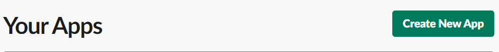
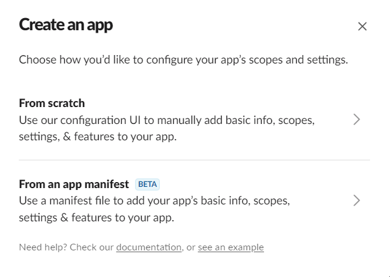
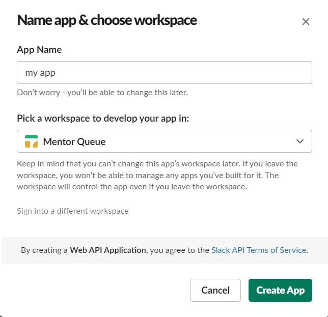
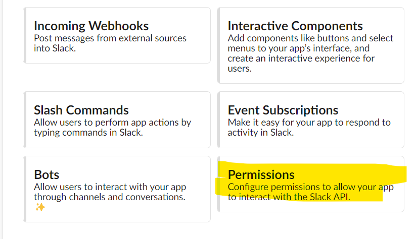
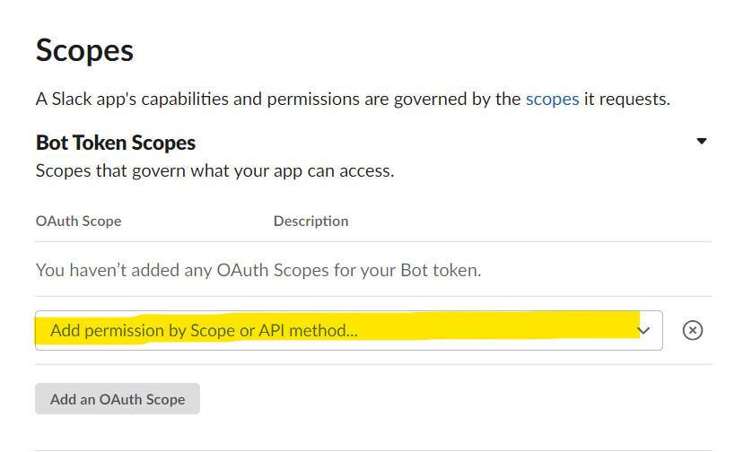
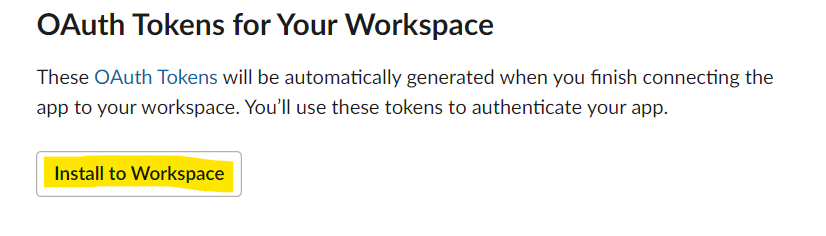
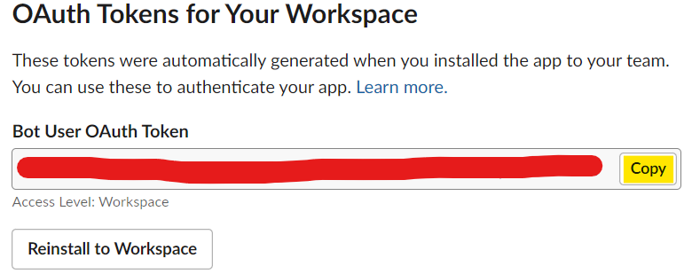
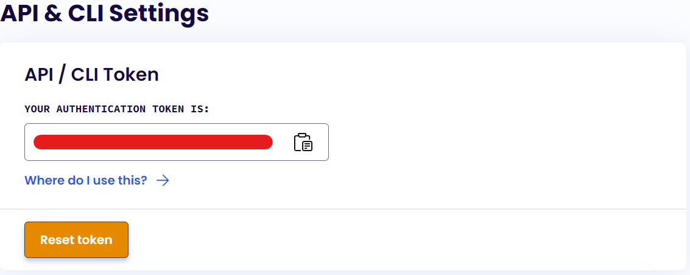

<!-- GETTING STARTED -->

## Getting Started

<div id="top"></div>
To get a local copy up and running follow these simple steps.

### Prerequisites

<!-- This is an example of how to list things you need to use the software and how to install them. -->

- vscode
  ```sh
  https://code.visualstudio.com/Download
  ```
- node
  ```sh
  https://nodejs.dev/learn/how-to-install-nodejs
  ```
- MongoDB Atlas Account

- Exercism Account

- Slack Workspace and User Account

### Installation

_Follow instructions below._

1. Create a slack App [https://api.slack.com/apps](https://api.slack.com/apps) (Prerequisites: Have a workspace and a slack account)
   

   1. Click Create New App.
      
   2. Click From Scratch.
      
   3. Enter App Name and select Workspace to add App to.
      
   4. Select Permissions.
      
   5. Scroll down to Scopes under Bot Token Scopes. Select dropdown "Add permissions by Scope or API method...".
      Give the bot these permissions in Bot Token Scopes : channels:join, channels:manage, chat:write and groups:write.
      For more info: [https://api.slack.com/methods/chat.delete](Slack Delete Method), [https://api.slack.com/methods/conversations.create](Slack Create Conversation Method), [https://api.slack.com/methods/chat.postMessage](Slack Post Message Method)
      
   6. Scroll up and under OAuth Tokens for Your Workspace click Install to Workspace. Then click Allow.
      
   7. Save the Bot User OAuth Token for later.

      

2. Get your Exercism token: [https://exercism.org/settings/api_cli](https://exercism.org/settings/api_cli) (Prerequisites: Have a exercism account)

3. Clone the repo
   ```sh
   git clone https://github.com/visionspider/exercism-mentor-request.git
   ```
4. Install NPM packages
   ```sh
   yarn install
   ```
5. Create a `.env` file at root directory
6. Enter your tokens in `.env`

   ```js
   MONGO_URI=mongodb+srv:/&/<username>:<password>@cluster0.tjwvx.mongodb.net/myFirstDatabase?retryWrites=true&w=majority
   ```

   <!-- prettier-ignore -->
   ```js
    SLACK_BOT_TOKEN=1234-123456789123-123456789123-123456789
   ```

   <!-- prettier-ignore -->
   ```js
   EXERCISM_TOKEN=12345678-1234-1234-1234-123456789123
   ```

   <!-- prettier-ignore -->
   ```js
   DB_NAME="insert database name here"

   ```

   <!-- prettier-ignore -->
   ```js
   REQ_COLLECTION_NAME="insert collection name here"
   ```

<p align="right">(<a href="#top">back to top</a>)</p>

<!-- USAGE EXAMPLES -->

<!-- ## Usage
